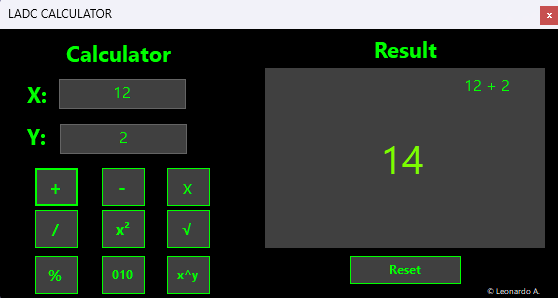
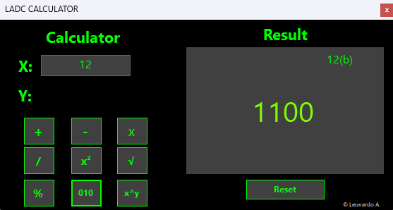
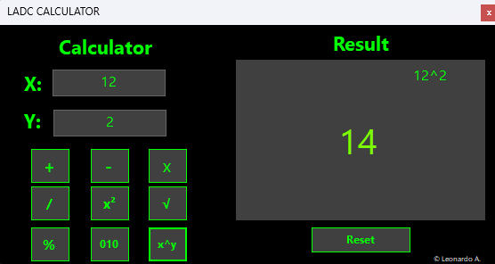

# Win Form Calculator

Este é um simples projeto, feito em Windows Forms com C#, de uma calculadora de operações básicas da matemática.

### Demonstração do programa:

### ?? Funções extras:

- Conversão de decimal para binário: 

- X elevado a potência de Y:

Baixe a versão do programa [aqui](https://github.com/Leonardo2745/ladc-winforms-calculator/releases/tag/version_1.0)
